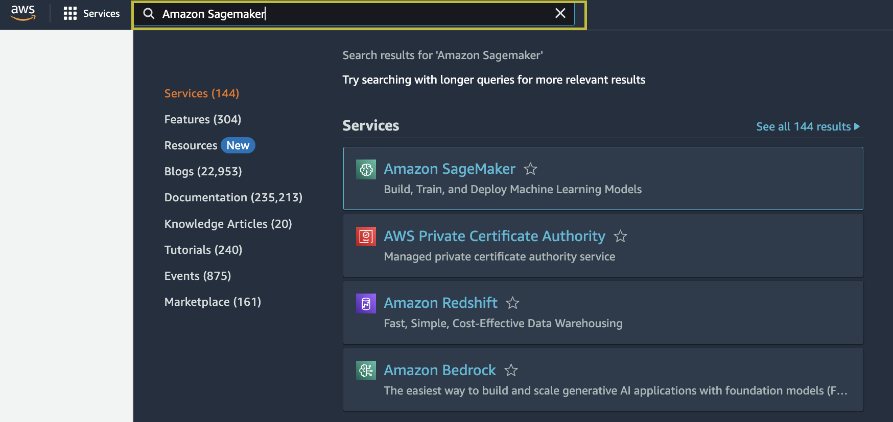
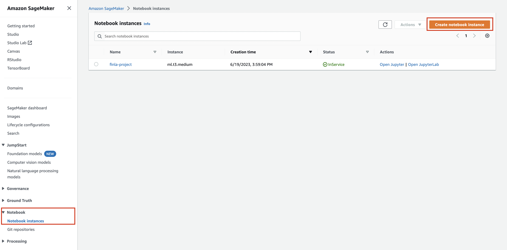
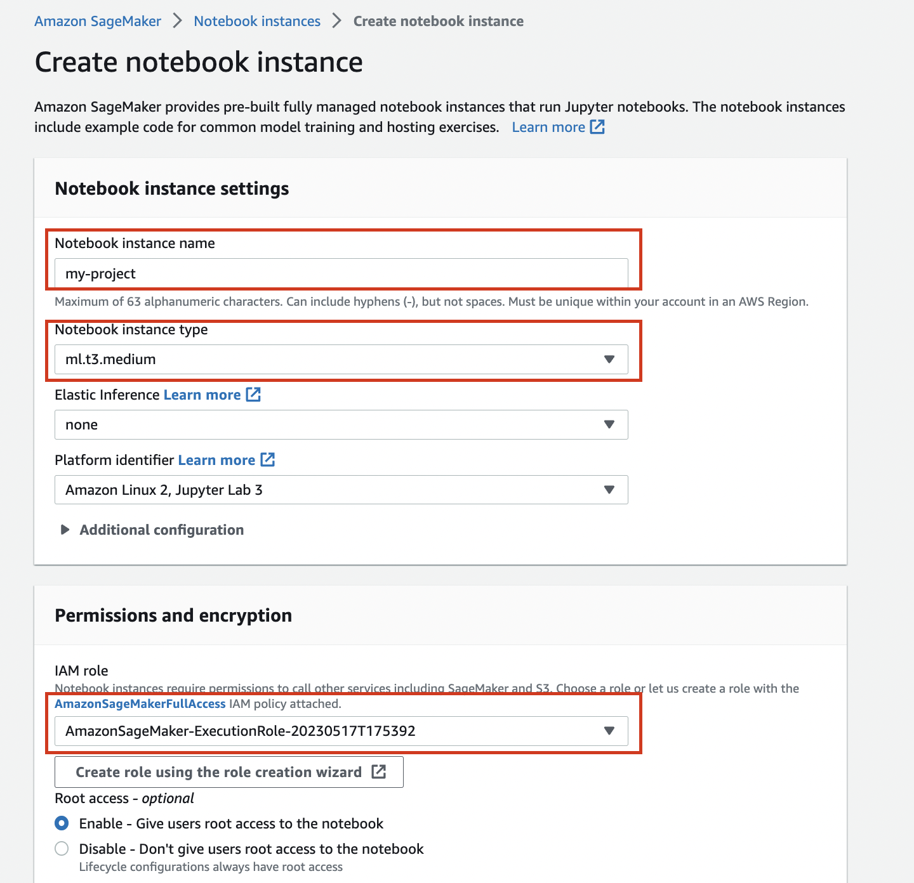

# Capstone Project: Inventory Monitoring at Distribution Centers

Knowing exactly the count of a physical inventory has been a key issue in all industries that are involved in manufacturing and retail processes. Historically, this is a job that warehouse managers and supply chain professionals have performed through cycle counting, an audit process for managing inventory counts.

In this notebook, a solution for object counting based in Machine Learning,is presented. The solution uses the Pytorch framework available from AWS SageMaker. The goal is to deploy a SageMaker endpoint that will query images to get predictions about the number of objects in the submitted image.

## Project Set Up and Installation

If you want to set up this project in AWS you need to follow the steps below:

1. Open Amazon SageMaker from AWS Main Console

2. Create a Notebook Instance

3. Select a name, a instance type an execution role for your instance

4. Upload the files of this repository to the Notebook Instance

## Dataset

### Overview
For this project, the [Amazon Bin Image Dataset](https://registry.opendata.aws/amazon-bin-imagery/) is used, which contains over 500,000 container images and metadata from a pod in a working Amazon fulfillment center. Container images in this dataset are captured when robot units transport pods as part of normal Amazon Fulfillment Center operations. Since this is a large dataset, in order not to exceed the budget available for the project, a subset of the dataset has been used.

The subset consists of 10.441 images which were split into train and test datasets (80% of data were used for training and 20% of data for testing). The final distribution of classes is presented in the table below

Class|Description|Total number of images|Images for training|Images for testing|
|----|-----------|----------------------|-------------------|------------------|
|1|Bins with one object|1228|982|245|
|2|Bins with two objects|2299|1839|459|
|3|Bins with three objects|2666|2132|533|
|4|Bins with four objects|2373|1898|474|
|5|Bins with five objects|1875|1500|375|

### Access

The following function allows download the subset to a local folder (train_data)

<code>
    def download_and_arrange_data():
        s3_client = boto3.client('s3')

        with open('file_list.json', 'r') as f:
            d=json.load(f)

        for k, v in d.items():
            print(f"Downloading Images with {k} objects")
            directory=os.path.join('train_data', k)
            if not os.path.exists(directory):
                os.makedirs(directory)
            for file_path in tqdm(v):
                file_name=os.path.basename(file_path).split('.')[0]+'.jpg'
                s3_client.download_file('aft-vbi-pds', os.path.join('bin-images', file_name),
                                 os.path.join(directory, file_name))
</code>

After split the subset in train and test datasets, they are uploa toa s3 bucket, for making the available to the training algorithms

<code>
    sagemaker_session = sagemaker.Session()

    bucket = sagemaker_session.default_bucket()
    prefix1 = "sagemaker/Final-Project/train"
    prefix2 = "sagemaker/Final-Project/test"

    train = sagemaker_session.upload_data(path="train", bucket=bucket, key_prefix=prefix1)
    print("train: {}".format(train))

    test = sagemaker_session.upload_data(path="test", bucket=bucket, key_prefix=prefix2)
    print("test: {}".format(test))
</code>    

## Model Training

The first objective was to build an Image Classification Model that can detect the number of objects in the images presented. For this, the Pytorch framework available from AWS SageMaker was used, which generates an Amazon-built Docker container that executes functions defined in the supplied entry_point script within a SageMaker Training Job.

Given that, a small subset is used for training purposes, a pre-trained Resnet50 Convolutional Neural Network was used for the model.  

The loss function selected was Cross Entropy and as optimizer the SGD algorithm was defined.

Once data was proper processed, three Training Scripts (python files) and a Submission Script (a jupyter notebook) were configured. 

The three Training Scripts used were:

1. *train.py*: Used for training the first model (fixed hyperparameters)
2. *hpo.py*: Used for executing the hyperparameter tuning
3. *trained_model.py*: Used for training the model with the best hyperparameters, adding debugging and profiling features

Finally, an endpoint was deployed in order to query predictions to the model from the images submitted. In this case, as entry model the *deployment.py* script was used.

The initially trained model obtained an 26% accuracy. That result is somehow expected, given that this exercise only uses 2% of the whole data available in data used in the [Amazon Bin Image Dataset](https://registry.opendata.aws/amazon-bin-imagery/)

## Machine Learning Pipeline

The implemented Machine Learning Pipeline includes the following steps:

1. Data Fetching
2. Data Preprocessing
3. Model Training
4. Hyperparameter Tuning
5. Debugging and Profiling
6. Deployment

## Hyperparameter Tuning

In order to obtain better hyperparameters, that could lead to a better performance of the model, an hyperparameter tuning is executed. The three hyperparameters selected were:

### 1. Learning Rate:

The learning rate is one of the most important hyperparameter when a neural network is configurated. This parameter controls how much to change the model in response to the estimated error each time the model weights are updated. High values can lead the neural network to learn a sub-optimal set of weights or even to unstable training process. Low values can produce long training process that could get stuck. This is a continuos hyperparameter, the optimal value will be search in the range [0.01, 0.1]

### 2. Batch Size:

This parameter defines the number of training examples the network evaluates before updating the internal model parameters. Reducing the batch size will allow less memory usage during traininig process and a faster training, however the smaller the batch the less accurate the estimate of the gradient will be. A large batch size, or even all the sample data, which results in smooth converge to a deep, local minimum, but could require great amount of memory during the training. This is a categorical hyperparameter, the optimal value will be search within the follow values [32, 64, 128]

### 3. Epoch:

In terms of training process an epoch could be defined as a one forward pass and one backward pass of all the training examples. Small number of epochs results in underfitting, while too many epochs will lead to overfitting. This is a integer hyperparameter, the optimal value will be search in the range [1, 10]

## Model Profiling and Debugging
The best hyperparameters obtained from hyperparameter tuning process are used to train a new model. In this case, profiling and debugging are configured to monitor and debug the new training job.

## Model Deploying and Querying
Finally, an endpoint is deployed and a prediction is ran.